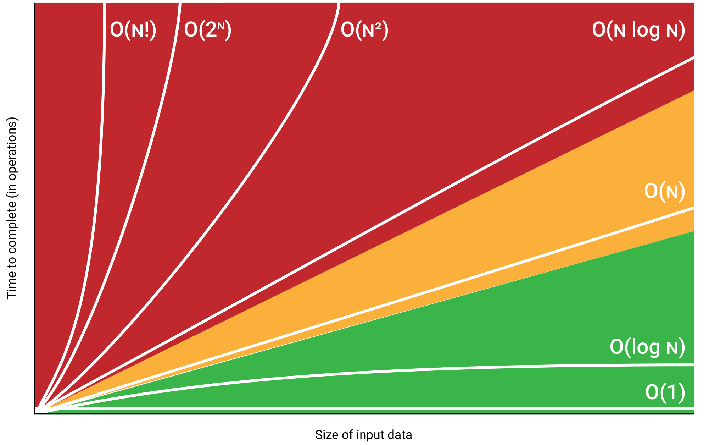
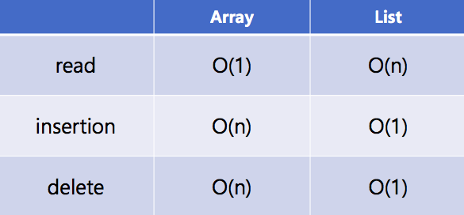

## introduction
---

> 알고리즘이란?
>
> 어떤 명령을 하기 위한 집합

### Big O 표기법

* 알고리즘은 시간이 아니라 연산 휫수가 어떻게 증가하는지로 측정하는데, 이 때 Big O 표기법을 사용한다

* Big O 표기법은 최악의 경우에 대한 것이다 (한 번에 찾는 경우가 있지만 최선의 경우라 할지라도 Big O 표기법은 달라지지 않는다)

* 상수는 무시한다

* 순서 (위로 갈수록 빠르다)

  O(log n) - 이진 탐색

  O(n) - 단순 탐색

  O(n * log n) - 퀵 정렬

  O(n^2) - 선택 정렬

  O(n!) - 외판원 문제

### 배열과 리스트의 차이

배열은 원소가 순서대로 저장되기 때문에 원소의 크기 만큼 메모리(공간)가 확보 되어 있어야 한다. 하지만 리스트는 다음 메모리의 주소를 앞의 원소에서 이미 알고 있기 때문에 어떤 메모리든 비어 있는 곳을 사용하고 그 주소를 앞의 원소에 저장해두면 된다(사용성 좋음). 배열이 리스트보다 좋은 점은 원소를 읽을 때다. 배열의 경우 원소가 순차적으로 놓여 있기 때문에 인덱스 번호만 알면 원소를 읽을 수 있지만(임의 접근), 리스트의 경우 처음 원소에서 해당 원소까지 순서대로 이동해야만 읽을 수 있다(순차 접근)

