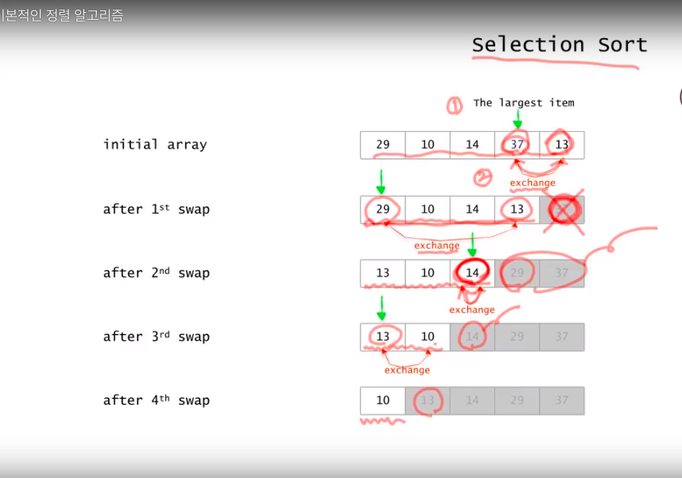
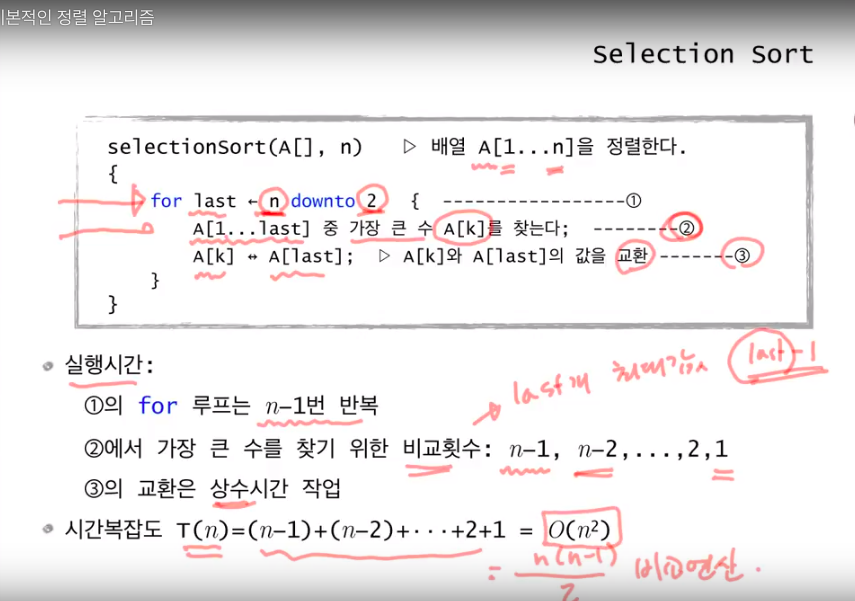
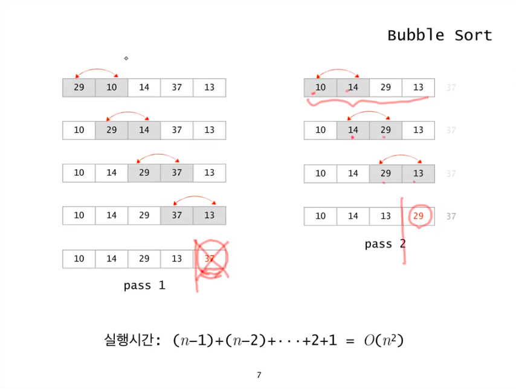
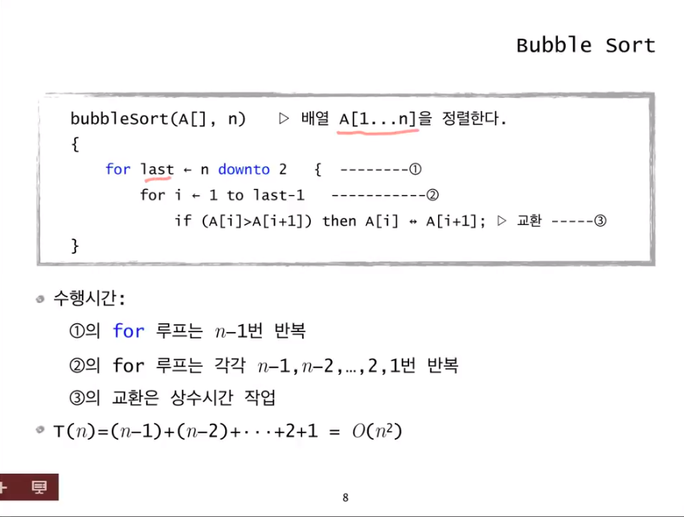
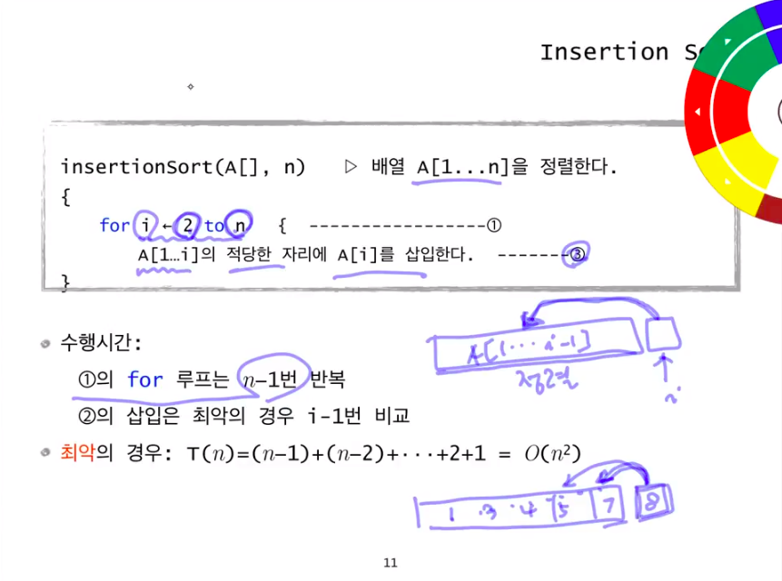
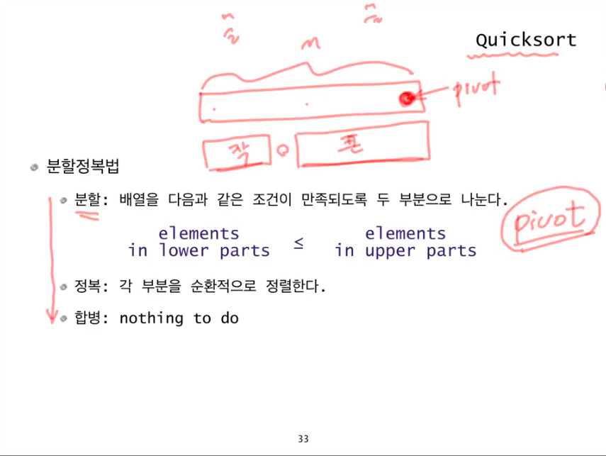
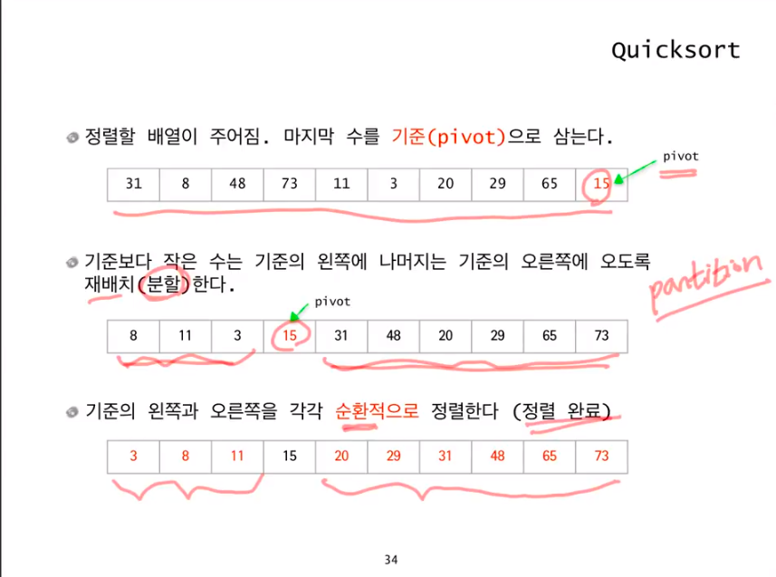
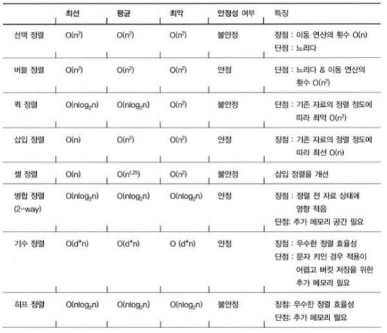

## Sorting

> 자주 사용하는 bubble sort와 sort 중 가장 빠른 quick sort 익혀 두기

### sorting algorithm

평균적으로 가장 빠른 sort는 quickSort이다. 하지만 worst case의 경우 quickSort의 시간복잡도 역시 O(n^2)이다

 

 

### selection sort

* 그림 이해하기

* pseudo code

 

 

### 

### bubble sort

* 그림 이해하기

* pseudo code

 

 

### 

### insertion sort

* 그림 이해하기

* pseudo code

 

 

### quick sort

* divide conquer

  - base case 찾기

  - base case가 될 때 까지 나누기 (recursive case)

* 그림 이해하기

*  pseudo code

 

 

### 

* quickSort vs mergeSort

  quickSort는 일반적으로 O(n * log n)의 시간 복잡도를 갖는다. 최악의 경우에는 O(n^2)의 시간 복잡도를 갖는다. Big O 표기법은 최악의 경우에 대해 시간 복잡도를 정의하지만, 일반적인 경우가 훨씬 많이 발생하기 때문에 O(n * log n)으로 표기한다. mergeSort는 최악의 경우 역시 시간 복잡도가 O(n * log n)이다. 따라서 mergeSort가 quickSort에 비해 더 빠르다고 생각할 수 있지만, mergeSort의 상수 값이 훨씬 크기 떄문에 Big O 표기법이 같다고 하더라도 quickSort가 평균적으로 빠르게 동작한다. 다만 최악의 경우에 대해서는 mergeSort가 더 빠르다고 할 수 있겠다

* 추가적으로 궁금한 내용 아래 링크 참조

  https://medium.com/@fiv3star/%EC%A0%95%EB%A0%AC%EC%95%8C%EA%B3%A0%EB%A6%AC%EC%A6%98-sorting-algorithm-%EC%A0%95%EB%A6%AC-8ca307269dc7

  http://hsp1116.tistory.com/33

 

 

### 							비교

